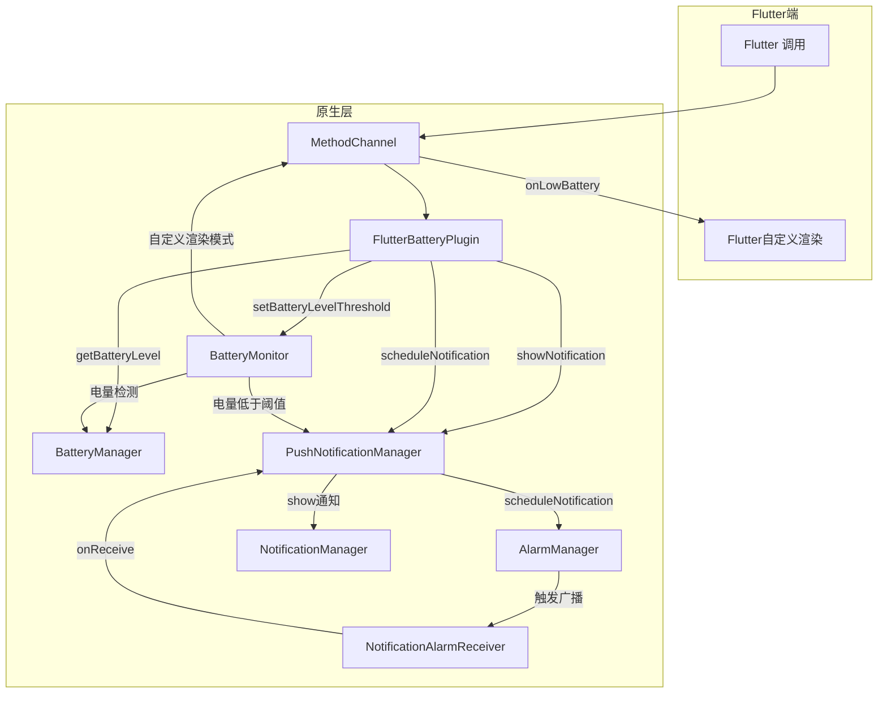
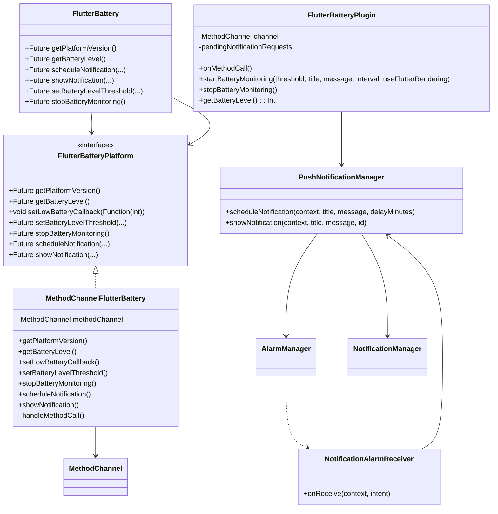

# flutter_battery

Flutter Android 推送通知和电池监控插件，支持立即通知、延迟通知和低电量监控。

## 功能概述

- 获取平台版本信息
- 获取当前电池电量
- 监控电池电量，低于阈值时发送通知
- 支持Flutter自定义渲染低电量通知
- 立即发送本地通知
- 调度延迟通知（通过 AlarmManager 和 BroadcastReceiver）

## 核心代码调用关系



## 使用方式

1. 在 `pubspec.yaml` 中添加本地依赖：
   ```yaml
   dependencies:
     flutter_battery:
       path: ../
   ```
2. 在 Dart 代码中导入并调用：
   ```dart
   import 'package:flutter_battery/flutter_battery.dart';

   final flutterBattery = FlutterBattery();

   // 获取平台版本
   String? version = await flutterBattery.getPlatformVersion();

   // 获取电池电量
   int? level = await flutterBattery.getBatteryLevel();

   // 立即发送通知
   await flutterBattery.showNotification(
     title: '示例标题',
     message: '示例内容',
   );

   // 调度延迟通知
   await flutterBattery.scheduleNotification(
     title: '延迟标题',
     message: '延迟内容',
     delayMinutes: 5,
   );
   
   // 设置电池电量低于阈值时的通知（原生渲染模式）
   await flutterBattery.setBatteryLevelThreshold(
     threshold: 20, // 低于20%时触发
     title: '电量不足提醒',
     message: '电池电量低于20%，请及时充电',
     intervalMinutes: 15, // 每15分钟检查一次
     useFlutterRendering: false, // 使用原生通知
   );
   
   // 设置电池电量低于阈值时的通知（Flutter渲染模式）
   await flutterBattery.setBatteryLevelThreshold(
     threshold: 15,
     title: '', // Flutter渲染模式下可不传
     message: '', // Flutter渲染模式下可不传
     intervalMinutes: 10,
     useFlutterRendering: true,
     onLowBattery: (int batteryLevel) {
       // 在这里自定义处理低电量事件
       print('电池电量低: $batteryLevel%');
       // 可以显示自定义UI、播放声音等
     },
   );
   
   // 停止电池监控
   await flutterBattery.stopBatteryMonitoring();
   ```

## 示例应用演示

本插件提供 `example` 示例应用，通过图形界面一键调试所有功能：

- **电池电量刷新**：点击"刷新电池电量"按钮，获取并展示当前电量
- **推送通知**：在"推送通知"板块填写标题/内容，点击"立即发送通知"或"调度延迟通知"测试通知
- **电池低电量监控**：在"电池监控"板块：
  1. 输入电量阈值（%）、通知标题/内容、检查间隔（分钟）
  2. 切换"使用Flutter自定义渲染"以选择原生通知或Flutter弹窗
  3. 点击"开始监控"后，若电量低于阈值，将触发相应提醒；点击"停止监控"可结束监测

## 项目结构

```
flutter_battery/
├─ android/          # Android 原生插件实现
├─ lib/              # Dart 插件接口和方法通道实现
├─ example/          # 示例应用
└─ README.md         # 项目说明文档
```

---

izy | GitHub: https://github.com/lizy-coding



