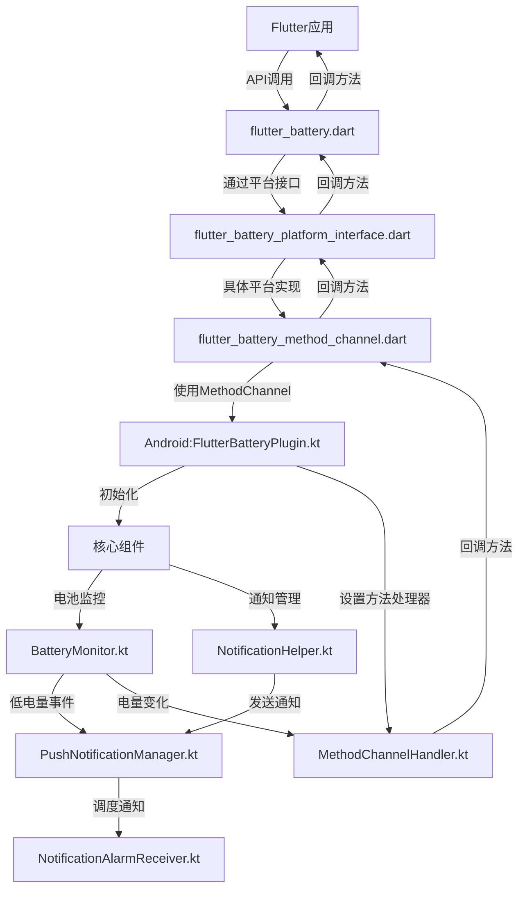
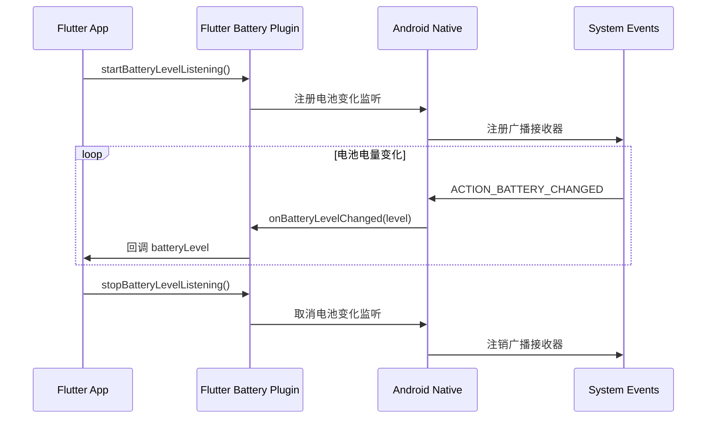

# Flutter Battery Plugin

Flutter插件，用于监控设备电池电量并在电量低于特定阈值时发送通知，同时支持实时监听电池电量变化。

## 功能特性

- 获取当前电池电量百分比
- 实时监听电池电量变化
- 设置电池低电量阈值监控
- 支持系统通知或Flutter自定义UI响应低电量
- 支持定时或即时推送通知
- 电池电量动画组件可视化展示
- 跨平台支持（Android）

## 项目结构

### Flutter (Dart) 部分

```
lib/
├── flutter_battery.dart             # 插件主入口，提供API封装
├── flutter_battery_platform_interface.dart  # 平台接口定义
├── flutter_battery_method_channel.dart      # Method Channel实现
└── battery_animation.dart           # 电池动画UI组件
```

### Android (Kotlin) 部分

```
android/src/main/kotlin/com/example/flutter_battery/
├── FlutterBatteryPlugin.kt          # 插件主类，负责初始化和生命周期管理
├── channel/                         # 通道相关
│   └── MethodChannelHandler.kt      # 方法通道处理器
└── core/                            # 核心功能
    ├── BatteryMonitor.kt            # 电池监控核心逻辑
    └── NotificationHelper.kt        # 通知助手

android/src/main/kotlin/com/example/push_notification/
├── PushNotificationManager.kt       # 通知管理
├── PushNotificationInitializer.kt   # 通知初始化
└── receiver/
    └── NotificationAlarmReceiver.kt # 通知接收器
```

## 安装

将此依赖项添加到您的`pubspec.yaml`文件中：

```yaml
dependencies:
  flutter_battery:
    git:
      url: https://github.com/yourname/flutter_battery.git
      ref: main
```

## 使用方法

### 导入

```dart
import 'package:flutter_battery/flutter_battery.dart';
```

### 初始化插件

```dart
final flutterBatteryPlugin = FlutterBattery();
```

### 获取电池电量

```dart
final int? batteryLevel = await flutterBatteryPlugin.getBatteryLevel();
print('当前电池电量: $batteryLevel%');
```

### 监听电池电量变化

```dart
// 设置电池电量变化监听
flutterBatteryPlugin.setBatteryLevelChangeListener((batteryLevel) {
  print('电池电量变化: $batteryLevel%');
  // 在这里更新UI或执行其他操作
});

// 开始监听
await flutterBatteryPlugin.startBatteryLevelListening();

// 停止监听
await flutterBatteryPlugin.stopBatteryLevelListening();
```

### 设置电池电量监控

使用系统通知：

```dart
await flutterBatteryPlugin.setBatteryLevelThreshold(
  threshold: 20,  // 设置电量阈值为20%
  title: '电池电量低',
  message: '您的电池电量低于20%，请及时充电',
  intervalMinutes: 15,  // 每15分钟检查一次
  useFlutterRendering: false,  // 使用系统通知
);
```

使用Flutter自定义UI响应：

```dart
await flutterBatteryPlugin.setBatteryLevelThreshold(
  threshold: 20,
  title: '电池电量低',
  message: '您的电池电量低于20%，请及时充电',
  intervalMinutes: 15,
  useFlutterRendering: true,  // 使用Flutter UI
  onLowBattery: (int batteryLevel) {
    // 在此处理低电量事件，例如显示自定义对话框
    showDialog(
      context: context,
      builder: (context) => LowBatteryDialog(
        batteryLevel: batteryLevel,
        onDismiss: () {
          print('用户关闭了低电量警告');
        },
      ),
    );
  },
);
```

### 停止电池监控

```dart
await flutterBatteryPlugin.stopBatteryMonitoring();
```

### 发送通知

立即发送通知：

```dart
await flutterBatteryPlugin.showNotification(
  title: '通知标题',
  message: '通知内容',
);
```

调度延迟通知：

```dart
await flutterBatteryPlugin.scheduleNotification(
  title: '延迟通知',
  message: '这是一个延迟通知',
  delayMinutes: 5,  // 5分钟后显示
);
```

### 使用电池动画组件

```dart
BatteryAnimation(
  batteryLevel: 75,
  width: 150,
  height: 300,
  isCharging: true,
  showPercentage: true,  // 显示百分比
  warningLevel: 20,      // 设置警告电量阈值
)
```

## API 文档

### FlutterBattery 类

主要的插件类，提供所有功能的访问点。

#### 方法

| 方法名 | 参数 | 返回值 | 描述 |
|-------|------|-------|------|
| `getPlatformVersion` | 无 | `Future<String?>` | 获取平台版本 |
| `getBatteryLevel` | 无 | `Future<int?>` | 获取当前电池电量百分比 |
| `setBatteryLevelChangeListener` | `Function(int)` | `void` | 设置电池电量变化监听器 |
| `startBatteryLevelListening` | 无 | `Future<bool?>` | 开始监听电池电量变化 |
| `stopBatteryLevelListening` | 无 | `Future<bool?>` | 停止监听电池电量变化 |
| `setBatteryLevelThreshold` | `threshold`, `title`, `message`, `intervalMinutes`, `useFlutterRendering`, `onLowBattery` | `Future<bool?>` | 设置电池电量低阈值监控 |
| `stopBatteryMonitoring` | 无 | `Future<bool?>` | 停止电池电量监控 |
| `showNotification` | `title`, `message` | `Future<bool?>` | 立即显示通知 |
| `scheduleNotification` | `title`, `message`, `delayMinutes` | `Future<bool?>` | 调度延迟通知 |

### BatteryAnimation 组件

电池动画UI组件，可视化展示电池电量。

#### 属性

| 属性名 | 类型 | 默认值 | 描述 |
|-------|------|-------|------|
| `batteryLevel` | `int` | 必填 | 电池电量百分比 |
| `width` | `double` | 100 | 电池宽度 |
| `height` | `double` | 200 | 电池高度 |
| `animationDuration` | `Duration` | 800ms | 动画持续时间 |
| `isCharging` | `bool` | false | 是否正在充电 |
| `showPercentage` | `bool` | true | 是否显示百分比文本 |
| `warningLevel` | `int` | 20 | 警告电量阈值，低于此值显示红色 |

## 调用链



## 事件流程



## Android权限

本插件需要以下Android权限：

```xml
<!-- 电池优化 -->
<uses-permission android:name="android.permission.REQUEST_IGNORE_BATTERY_OPTIMIZATIONS" />
<!-- 通知权限（Android 13+） -->
<uses-permission android:name="android.permission.POST_NOTIFICATIONS" />
```

## 常见问题

### 1. 电池监控在后台不工作？

确保您的应用已请求忽略电池优化权限，并在 Android 设置中允许应用在后台运行。

### 2. 通知没有显示？

在 Android 13 及以上版本，需要动态请求通知权限。本插件会自动处理权限请求，但用户可能拒绝授予权限。

### 3. 电量变化监听太频繁？

本插件已实现过滤机制，只有当电量值发生变化时才会触发回调，避免重复通知。

## 示例应用

查看 `example` 目录中的示例应用，了解完整的使用方法和实际效果。

## 许可证

MIT