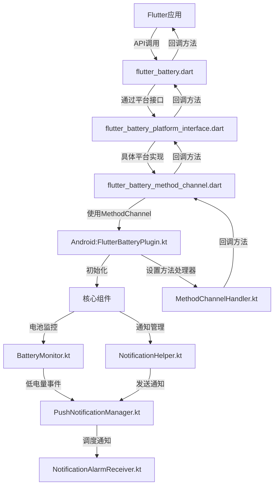

# Flutter Battery Plugin

Flutter插件，用于监控设备电池电量并在电量低于特定阈值时发送通知。

## 功能特性

- 获取当前电池电量百分比
- 设置电池低电量阈值监控
- 支持系统通知或Flutter自定义UI响应低电量
- 支持定时或即时推送通知
- 跨平台支持（Android）

## 项目结构

### Flutter (Dart) 部分

```
lib/
├── flutter_battery.dart             # 插件主入口，提供API封装
├── flutter_battery_platform_interface.dart  # 平台接口定义
├── flutter_battery_method_channel.dart      # Method Channel实现
└── battery_animation.dart           # 电池动画UI组件
```

### Android (Kotlin) 部分

```
android/src/main/kotlin/com/example/flutter_battery/
├── FlutterBatteryPlugin.kt          # 插件主类，负责初始化和生命周期管理
├── channel/                         # 通道相关
│   └── MethodChannelHandler.kt      # 方法通道处理器
└── core/                            # 核心功能
    ├── BatteryMonitor.kt            # 电池监控核心逻辑
    └── NotificationHelper.kt        # 通知助手

android/src/main/kotlin/com/example/push_notification/
├── PushNotificationManager.kt       # 通知管理
├── PushNotificationInitializer.kt   # 通知初始化
└── receiver/
    └── NotificationAlarmReceiver.kt # 通知接收器
```

## 安装

将此依赖项添加到您的`pubspec.yaml`文件中：

```yaml
dependencies:
  flutter_battery:
    git:
      url: https://github.com/yourname/flutter_battery.git
      ref: main
```

## 使用方法

### 导入

```dart
import 'package:flutter_battery/flutter_battery.dart';
```

### 初始化插件

```dart
final flutterBatteryPlugin = FlutterBattery();
```

### 获取电池电量

```dart
final int? batteryLevel = await flutterBatteryPlugin.getBatteryLevel();
print('当前电池电量: $batteryLevel%');
```

### 设置电池电量监控

使用系统通知：

```dart
await flutterBatteryPlugin.setBatteryLevelThreshold(
  threshold: 20,  // 设置电量阈值为20%
  title: '电池电量低',
  message: '您的电池电量低于20%，请及时充电',
  intervalMinutes: 15,  // 每15分钟检查一次
  useFlutterRendering: false,  // 使用系统通知
);
```

使用Flutter自定义UI响应：

```dart
await flutterBatteryPlugin.setBatteryLevelThreshold(
  threshold: 20,
  title: '电池电量低',
  message: '您的电池电量低于20%，请及时充电',
  intervalMinutes: 15,
  useFlutterRendering: true,  // 使用Flutter UI
  onLowBattery: (int batteryLevel) {
    // 在此处理低电量事件，例如显示自定义对话框
    showDialog(
      context: context,
      builder: (context) => LowBatteryDialog(
        batteryLevel: batteryLevel,
        title: '电池电量低',
        message: '您的电池电量低于阈值，请及时充电',
      ),
    );
  },
);
```

### 停止电池监控

```dart
await flutterBatteryPlugin.stopBatteryMonitoring();
```

### 发送通知

立即发送通知：

```dart
await flutterBatteryPlugin.showNotification(
  title: '通知标题',
  message: '通知内容',
);
```

调度延迟通知：

```dart
await flutterBatteryPlugin.scheduleNotification(
  title: '延迟通知',
  message: '这是一个延迟通知',
  delayMinutes: 5,  // 5分钟后显示
);
```

### 使用电池动画组件

```dart
BatteryAnimation(
  batteryLevel: 75,
  width: 150,
  height: 300,
  isCharging: true,
)
```

## 调用链



## Android权限

本插件需要以下Android权限：

```xml
<!-- 电池优化 -->
<uses-permission android:name="android.permission.REQUEST_IGNORE_BATTERY_OPTIMIZATIONS" />
<!-- 通知权限（Android 13+） -->
<uses-permission android:name="android.permission.POST_NOTIFICATIONS" />
```

## 许可证

MIT