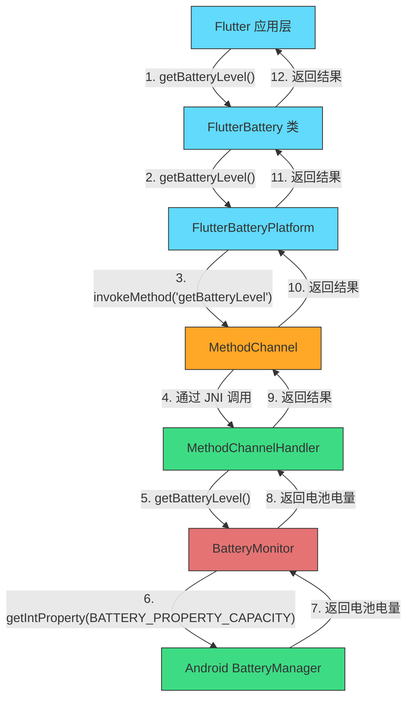
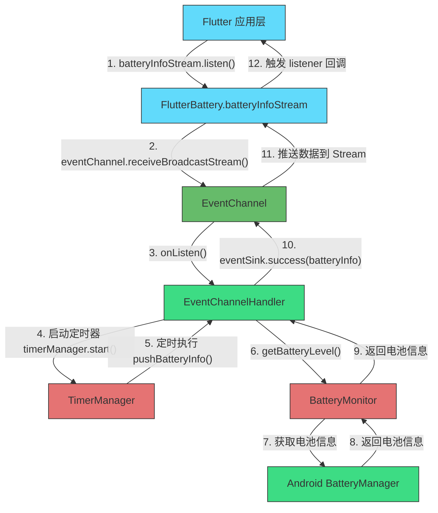
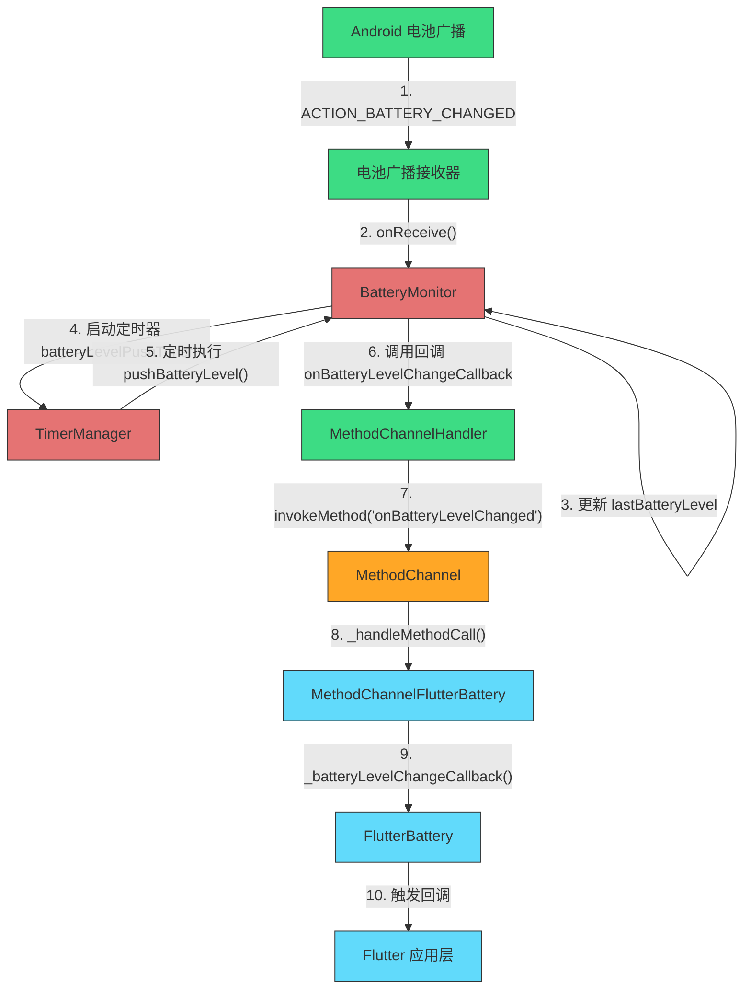

# Flutter Battery Plugin

Flutter插件，用于监控设备电池电量并在电量低于特定阈值时发送通知，同时支持实时监听电池电量变化和获取完整电池信息。


## 版本信息

当前版本: **0.0.3**

## 电池电量检测逻辑对比：主动查询 vs 推送模式

本插件提供了两种检测电池电量的方式：主动查询和推送模式。下面分别通过流程图展示这两种方法的工作原理及其关键 API 调用链，凸显 EventChannel 与 MethodChannel 的差异。

### 主动查询模式 (MethodChannel)

主动查询模式通过 MethodChannel 实现，由 Flutter 应用主动发起请求获取电池信息。



**MethodChannel 特点**:
- 单次请求-响应模式
- 适合主动查询场景
- 同步/异步调用
- 支持复杂参数和返回值

### 推送模式 (EventChannel)

推送模式主要通过 EventChannel 实现，由原生平台主动向 Flutter 推送电池状态变化。下面分别展示两种推送方式。

#### 1. EventChannel 推送方式



#### 2. 广播接收器推送方式



**EventChannel 特点**:
- 持续数据流模式
- 适合推送和监听场景
- 异步事件流
- 支持长连接场景
- 减少频繁查询开销

## 主动查询 vs 推送模式对比

| 特性 | 主动查询 (MethodChannel) | 推送模式 (EventChannel) |
|------|------------------------|------------------------|
| 调用方式 | 客户端主动发起请求 | 服务端主动推送数据 |
| 适用场景 | 按需获取电池信息 | 实时监控电池变化 |
| 资源消耗 | 每次查询都有开销 | 建立连接后开销较小 |
| 实时性 | 取决于查询频率 | 可配置推送间隔，更实时 |
| 实现复杂度 | 较简单 | 较复杂，需处理事件流 |
| 电量影响 | 频繁查询可能增加耗电 | 合理配置可减少耗电 |

## 关键API调用链

### 主动查询模式

1. Flutter层调用 `FlutterBattery.getBatteryLevel()`
2. 通过Platform Interface转发到MethodChannel
3. MethodChannel通过JNI调用Android原生方法
4. MethodChannelHandler接收并处理请求
5. 调用BatteryMonitor.getBatteryLevel()
6. 使用Android BatteryManager获取电池电量
7. 结果原路返回到Flutter层

### 推送模式

#### EventChannel方式
1. Flutter层订阅 `FlutterBattery.batteryInfoStream`
2. EventChannel设置监听器
3. EventChannelHandler.onListen()被触发
4. 启动TimerManager定时器
5. 定时器周期性调用pushBatteryInfo()
6. 获取电池信息并通过eventSink推送到Flutter
7. Flutter层的Stream监听器接收数据

#### 广播接收器方式
1. 注册接收ACTION_BATTERY_CHANGED广播
2. 电池状态变化时触发onReceive()
3. 更新电池状态并通过MethodChannel回调通知Flutter

## 项目结构

### Flutter 层 (`lib` 目录)

```
lib/
├── battery_animation.dart        # 电池动画组件实现
├── flutter_battery.dart          # 插件主类，提供所有公共API
├── flutter_battery_method_channel.dart  # 方法通道实现，处理与原生平台通信
└── flutter_battery_platform_interface.dart  # 平台接口定义，确保跨平台一致性
```

### Android 层 (`android/src/main/kotlin` 目录)

```
android/src/main/kotlin/
└── com/
    └── example/
        ├── flutter_battery/
        │   ├── FlutterBatteryPlugin.kt      # 插件主类，注册方法/事件通道
        │   ├── channel/
        │   │   ├── EventChannelHandler.kt   # 事件通道处理，用于流式数据
        │   │   └── MethodChannelHandler.kt  # 方法通道处理，用于请求/响应
        │   └── core/
        │       ├── BatteryMonitor.kt        # 电池监控核心实现
        │       ├── NotificationHelper.kt    # 通知管理助手
        │       └── TimerManager.kt          # 定时器管理
        └── push_notification/
            ├── PushNotificationManager.kt   # 推送通知管理（即时/延迟）
            ├── receiver/
            │   └── NotificationAlarmReceiver.kt  # 延迟通知接收器
            └── util/
                └── Constants.kt             # 常量定义
```

### 示例应用（`example` 目录）

```
example/
├── lib/
│   └── main.dart                    # 示例入口，演示查询与流监听
├── pubspec.yaml                     # 依赖本插件（path: ../）
└── analysis_options.yaml            # 示例分析规则
```

## 功能特性

- 获取当前电池电量百分比和完整电池信息（电量、温度、电压、充电状态等）
- 新增电池健康评估：实时推送健康状态、风险等级与推荐措施
- 实时监听电池电量、电池信息及电池健康变化
- 设置电池低电量阈值监控，支持系统通知或Flutter自定义UI
- 支持定时或即时推送通知
- 电池电量动画组件可视化展示
- 电池性能优化建议、防抖动机制
- IoT 原生桥接：模拟 BLE 设备扫描、连接、遥测与电池事件
- 线程安全的资源管理和错误处理
- 跨平台支持（Android）

## 项目结构

```
.
├── lib/                       # Flutter 插件 API 与组件
├── android/                   # Android 原生插件实现（含 IoT Jetpack 架构）
├── example/                   # Flutter 示例工程（演示 Battery + IoT）
├── integration/               # 预留集成测试
├── scripts/                   # 自动化/脚本工具
├── test/                      # Dart 单元测试
├── IOT_UPGRADE_PLAN.md        # IoT 能力演进计划
└── README.md                  # 当前文档
```

核心目录说明：

- `lib/`：对外公开的 `FlutterBattery` API、平台接口定义以及电池动画组件。
- `android/`：`FlutterBatteryPlugin`、电池监控核心 `BatteryMonitor`、通知工具、`iot/nativekit` Jetpack 架构（domain/data/presentation/service/platform）。
- `example/`：最小可运行示例，展示如何调用电池 APIs 以及通过 `MethodChannel('iot/native')` 与 IoT 原生层交互。
- `integration/`：保留用于未来的集成/端到端测试。
- `scripts/`：脚本、自动化工具及工程初始化模板。

## 原生通道与接口说明

### `flutter_battery` MethodChannel （电池能力）

| 方法 | 说明 | 参数 | 返回 |
| --- | --- | --- | --- |
| `getPlatformVersion()` | 返回 Android 版本 | - | `String` |
| `getBatteryLevel()` | 获取当前电量 | - | `int` (0-100) |
| `getBatteryInfo()` | 获取完整电池信息 | - | `Map` `{level,isCharging,temperature,voltage,state,timestamp}` |
| `getBatteryHealth()` | 获取电池健康状态 | - | `Map` `{state,statusLabel,riskLevel,recommendations,...}` |
| `getBatteryOptimizationTips()` | 返回优化建议 | - | `List<String>` |
| `setBatteryLevelThreshold()` | 启用低电量监控 | `threshold,title,message,intervalMinutes,useFlutterRendering` | `bool` |
| `stopBatteryMonitoring()` | 停止低电量监控 | - | `bool` |
| `setPushInterval()` | 设置推送间隔与防抖 | `intervalMs,enableDebounce` | `bool` |
| `startBatteryLevelListening()` / `stopBatteryLevelListening()` | 开关电量广播监听 | - | `bool` |
| `startBatteryInfoListening()` / `stopBatteryInfoListening()` | 开关完整信息推送 | `intervalMs` | `bool` |
| `startBatteryHealthListening()` / `stopBatteryHealthListening()` | 开关电池健康推送 | `intervalMs` | `bool` |
| `scheduleNotification()` / `showNotification()` / `sendNotification()` | 调度或立即显示系统通知 | `title,message,delay/delayMinutes` | `bool` |

> Flutter 侧的 `FlutterBattery.configureBattery / configureBatteryMonitor / configureBatteryCallbacks` 封装了上表中的多个原生调用，推荐优先使用高阶 API。

#### `flutter_battery/battery_stream` EventChannel

- 默认 payload：`{batteryLevel: int, timestamp: int}`（电量心跳）
- `type == "BATTERY_INFO"`：携带 `BatteryInfo` 字段
- `type == "BATTERY_HEALTH"`：携带 `BatteryHealth` 字段（风险等级、建议列表等）
- 所有事件均由 `EventChannelHandler` 管理，支持 `setPushInterval` 和 `setBatteryInfoPush / setBatteryHealthPush` 控制频率。

### `iot/native` MethodChannel （IoT 模块）

| 方法 | 说明 | 参数 | 返回 |
| --- | --- | --- | --- |
| `scanDevices` | 开始扫描模拟 BLE 设备 | - | `void` |
| `stopScan` | 停止扫描 | - | `void` |
| `connect` | 连接指定设备 | `deviceId` | `void` |
| `disconnect` | 断开当前设备 | - | `void` |
| `startSync` | 启动前台同步服务（推送遥测） | - | `void` |
| `stopSync` | 停止同步服务 | - | `void` |

#### `iot/stream` EventChannel

事件 payload 统一结构 `{type: String, payload: ...}`：

- `type == "devices"`：`payload` 为设备列表（字段 `id,name,rssi,connected`）。
- `type == "telemetry"`：`payload` 为 `Telemetry` Map（`timestamp,speed,batteryPct`）。
- `type == "battery"`：`payload` 为 `{value: Int}`，模拟远端设备电量。

> 插件内部已在 `FlutterBatteryPlugin` 中调用 `IotNativeInitializer.attach()`，示例应用只需订阅 `EventChannel('iot/stream')` 即可。

## 安装

将此依赖项添加到您的`pubspec.yaml`文件中：

```yaml
dependencies:
  flutter_battery:
   git:
     url: https://github.com/yourname/flutter_battery.git
     ref: main
```

## 使用方法

### 导入

```dart
import 'package:flutter_battery/flutter_battery.dart';
```

### 初始化插件

```dart
final flutterBatteryPlugin = FlutterBattery();
```

### 快速集成（推荐）

使用一次性配置方法设置所有电池监控功能：

```dart
// 配置所有电池监控功能
await flutterBatteryPlugin.configureBattery(
  BatteryConfiguration(
    // 基本监听配置
    monitorConfig: BatteryMonitorConfig(
      monitorBatteryLevel: true,     // 是否监控电池电量
      monitorBatteryInfo: true,      // 是否监控电池完整信息
      intervalMs: 1000,              // 电量更新间隔（毫秒）
      batteryInfoIntervalMs: 5000,   // 电池信息更新间隔（毫秒）
      enableDebounce: true,          // 启用防抖动
    ),
    
    // 低电量监控配置
    lowBatteryConfig: BatteryLevelMonitorConfig(
      enable: true,                  // 启用低电量监控
      threshold: 20,                 // 电量阈值（%）
      title: '电池电量低',            // 通知标题
      message: '您的电池电量低于20%',  // 通知内容
      intervalMinutes: 15,           // 检查间隔
      useFlutterRendering: true,     // 使用Flutter UI
    ),
    
    // 回调函数设置
    onBatteryLevelChange: (batteryLevel) {
      print('电池电量变化: $batteryLevel%');
    },
    
    onBatteryInfoChange: (info) {
      print('电池信息更新: $info');
    },
    
    onLowBattery: (batteryLevel) {
      // 处理低电量事件
      showDialog(
        context: context,
        builder: (context) => AlertDialog(
          title: Text('电池电量低'),
          content: Text('当前电量: $batteryLevel%'),
          actions: [
            TextButton(
              onPressed: () => Navigator.pop(context),
              child: Text('确定'),
            ),
          ],
        ),
      );
    },
  ),
);
```

### 配置特定功能

如果需要单独配置特定功能，可以使用以下方法：

#### 配置电池监听

```dart
await flutterBatteryPlugin.configureBatteryMonitor(
  BatteryMonitorConfig(
    monitorBatteryLevel: true,
    monitorBatteryInfo: true,
    monitorBatteryHealth: true,
    intervalMs: 2000,
    batteryInfoIntervalMs: 10000,
    batteryHealthIntervalMs: 15000,
    enableDebounce: true,
  ),
);
```

#### 配置电池回调

```dart
flutterBatteryPlugin.configureBatteryCallbacks(
  onBatteryLevelChange: (batteryLevel) {
    print('电池电量变化: $batteryLevel%');
  },
  onBatteryInfoChange: (info) {
    print('电池信息更新: $info');
  },
  onBatteryHealthChange: (health) {
    print('电池健康状态: $health');
  },
  onLowBattery: (batteryLevel) {
    print('低电量警告: $batteryLevel%');
  },
);
```

#### 配置低电量监控

```dart
await flutterBatteryPlugin.configureBatteryMonitoring(
  BatteryLevelMonitorConfig(
    enable: true,
    threshold: 15,
    title: '电量不足提醒',
    message: '电池电量低于15%，请及时充电',
    intervalMinutes: 30,
    useFlutterRendering: false,
  ),
);
```

### 基本操作

#### 获取电池电量

```dart
final batteryLevel = await flutterBatteryPlugin.getBatteryLevel();
print('当前电池电量: $batteryLevel%');
```

#### 获取完整电池信息

```dart
final batteryInfo = await flutterBatteryPlugin.getBatteryInfo();
print('电池信息: $batteryInfo');
// 输出: 电池信息: BatteryInfo(level: 85%, isCharging: true, temperature: 37.5°C, voltage: 4.35V, state: BatteryState.CHARGING)
```

#### 获取电池健康

```dart
final batteryHealth = await flutterBatteryPlugin.getBatteryHealth();
print('电池健康: $batteryHealth');
// BatteryHealth(state: BatteryHealthState.good, risk: LOW, temp: 32.0°C)
```

#### 获取电池优化建议

```dart
final tips = await flutterBatteryPlugin.getBatteryOptimizationTips();
for (final tip in tips) {
  print('电池优化建议: $tip');
}
```

#### 发送通知

```dart
// 立即发送通知
await flutterBatteryPlugin.sendNotification(
  title: '应用通知',
  message: '这是一条测试通知消息',
  delay: 0,
);

// 延迟发送通知
await flutterBatteryPlugin.sendNotification(
  title: '延迟通知',
  message: '这条通知将在5分钟后显示',
  delay: 5,  // 5分钟后发送
);
```

#### 停止电池监控

```dart
await flutterBatteryPlugin.stopBatteryMonitoring();
```

### 使用电池动画组件

```dart
BatteryAnimation(
  batteryLevel: 75,
  width: 150,
  height: 300,
  isCharging: true,
  showPercentage: true,  // 显示百分比
  warningLevel: 20,      // 设置警告电量阈值
)
```

## 版本兼容性

- **0.0.3 及以上版本**: 使用配置类和整合API (本文档中的所有示例)
- **0.0.1-0.0.2 版本**: 仍支持老API，但建议升级到最新版本以获得更好的性能和简化的API

## 常见问题

### 1. 电池监控在后台不工作？

确保您的应用已请求忽略电池优化权限，并在 Android 设置中允许应用在后台运行。

### 2. 通知没有显示？

在 Android 13 及以上版本，需要动态请求通知权限。本插件会自动处理权限请求，但用户可能拒绝授予权限。

### 3. 如何高效监控电池？

推荐使用`configureBattery()`方法一次性配置所有需要的电池监控功能，减少多次API调用。

## 许可证

MIT
