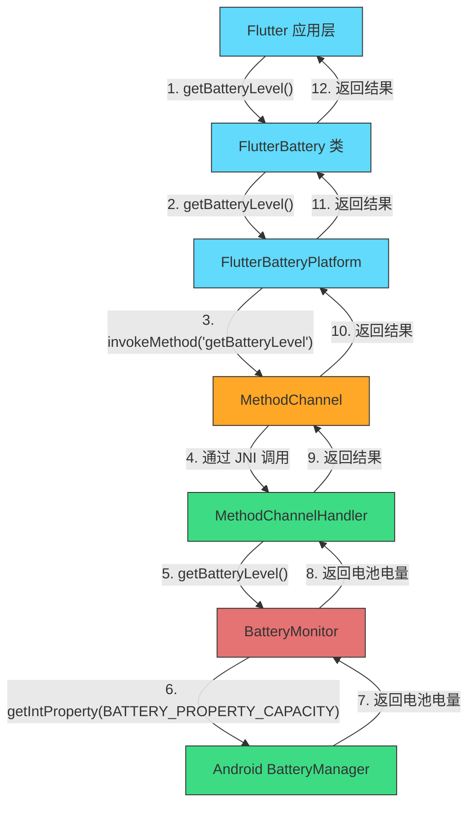
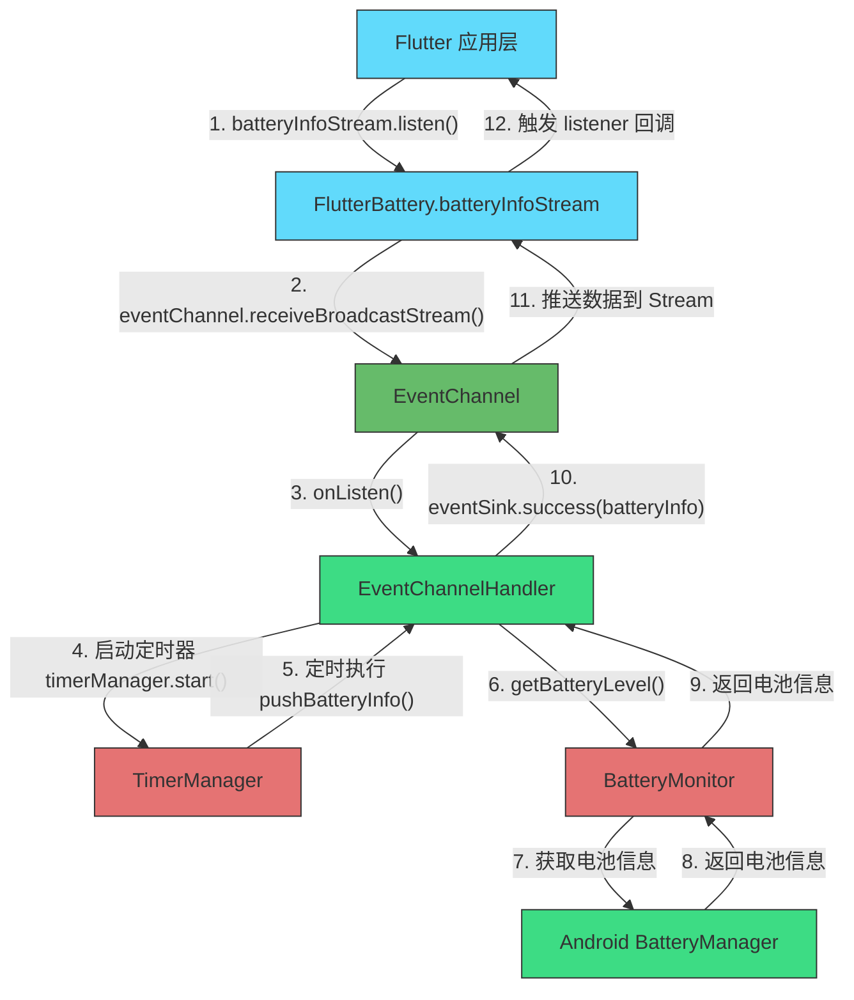
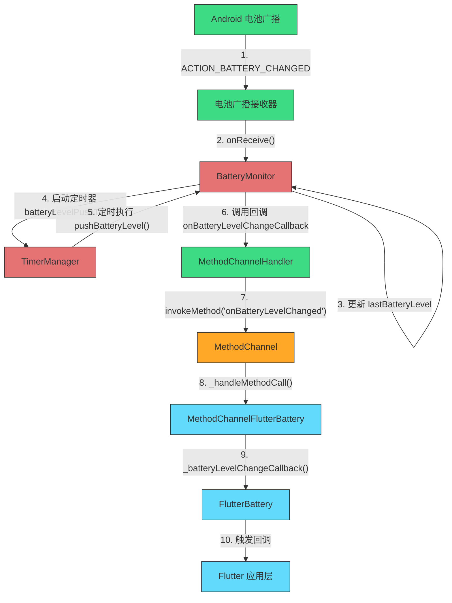

# Flutter Battery Plugin

Flutter插件，用于监控设备电池电量并在电量低于特定阈值时发送通知，同时支持实时监听电池电量变化和获取完整电池信息。


## 系统监控电量


## 蓝牙查询电量


## 版本信息

当前版本: **0.0.3**

## 电池电量检测逻辑对比：主动查询 vs 推送模式

本插件提供了两种检测电池电量的方式：主动查询和推送模式。下面分别通过流程图展示这两种方法的工作原理及其关键 API 调用链，凸显 EventChannel 与 MethodChannel 的差异。

### 主动查询模式 (MethodChannel)

主动查询模式通过 MethodChannel 实现，由 Flutter 应用主动发起请求获取电池信息。


```mermaid
graph TB
    classDef flutter fill:#61DAFB,stroke:#333,stroke-width:1px,color:#333
    classDef android fill:#3DDC84,stroke:#333,stroke-width:1px,color:#333
    classDef methodChannel fill:#FFA726,stroke:#333,stroke-width:1px,color:#333
    classDef core fill:#E57373,stroke:#333,stroke-width:1px,color:#333
    
    FlutterApp["Flutter 应用层"]:::flutter
    FlutterApp -->|"1. getBatteryLevel()"| FlutterBattery["FlutterBattery 类"]:::flutter
    FlutterBattery -->|"2. getBatteryLevel()"| PlatformInterface["FlutterBatteryPlatform"]:::flutter
    PlatformInterface -->|"3. invokeMethod('getBatteryLevel')"| MethodChannel["MethodChannel"]:::methodChannel
    MethodChannel -->|"4. 通过 JNI 调用"| MethodHandler["MethodChannelHandler"]:::android
    MethodHandler -->|"5. getBatteryLevel()"| BatteryMonitor["BatteryMonitor"]:::core
    BatteryMonitor -->|"6. getIntProperty(BATTERY_PROPERTY_CAPACITY)"| AndroidBatteryManager["Android BatteryManager"]:::android
    AndroidBatteryManager -->|"7. 返回电池电量"| BatteryMonitor
    BatteryMonitor -->|"8. 返回电池电量"| MethodHandler
    MethodHandler -->|"9. 返回结果"| MethodChannel
    MethodChannel -->|"10. 返回结果"| PlatformInterface
    PlatformInterface -->|"11. 返回结果"| FlutterBattery
    FlutterBattery -->|"12. 返回结果"| FlutterApp
```

**MethodChannel 特点**:
- 单次请求-响应模式
- 适合主动查询场景
- 同步/异步调用
- 支持复杂参数和返回值

### 推送模式 (EventChannel)

推送模式主要通过 EventChannel 实现，由原生平台主动向 Flutter 推送电池状态变化。下面分别展示两种推送方式。

#### 1. EventChannel 推送方式


```mermaid
graph TB
    classDef flutter fill:#61DAFB,stroke:#333,stroke-width:1px,color:#333
    classDef android fill:#3DDC84,stroke:#333,stroke-width:1px,color:#333
    classDef eventChannel fill:#66BB6A,stroke:#333,stroke-width:1px,color:#333
    classDef core fill:#E57373,stroke:#333,stroke-width:1px,color:#333
    
    FlutterApp["Flutter 应用层"]:::flutter
    FlutterBatteryStream["FlutterBattery.batteryInfoStream"]:::flutter
    EventChannel["EventChannel"]:::eventChannel
    EventHandler["EventChannelHandler"]:::android
    TimerManager1["TimerManager"]:::core
    BatteryMonitor["BatteryMonitor"]:::core
    AndroidBatteryManager["Android BatteryManager"]:::android
    
    FlutterApp -->|"1. batteryInfoStream.listen()"| FlutterBatteryStream
    FlutterBatteryStream -->|"2. eventChannel.receiveBroadcastStream()"| EventChannel
    EventChannel -->|"3. onListen()"| EventHandler
    EventHandler -->|"4. 启动定时器 timerManager.start()"| TimerManager1
    TimerManager1 -->|"5. 定时执行 pushBatteryInfo()"| EventHandler
    EventHandler -->|"6. getBatteryLevel()"| BatteryMonitor
    BatteryMonitor -->|"7. 获取电池信息"| AndroidBatteryManager
    AndroidBatteryManager -->|"8. 返回电池信息"| BatteryMonitor
    BatteryMonitor -->|"9. 返回电池信息"| EventHandler
    EventHandler -->|"10. eventSink.success(batteryInfo)"| EventChannel
    EventChannel -->|"11. 推送数据到 Stream"| FlutterBatteryStream
    FlutterBatteryStream -->|"12. 触发 listener 回调"| FlutterApp
```

#### 2. 广播接收器推送方式


```mermaid
graph TB
    classDef flutter fill:#61DAFB,stroke:#333,stroke-width:1px,color:#333
    classDef android fill:#3DDC84,stroke:#333,stroke-width:1px,color:#333
    classDef methodChannel fill:#FFA726,stroke:#333,stroke-width:1px,color:#333
    classDef core fill:#E57373,stroke:#333,stroke-width:1px,color:#333
    
    FlutterApp["Flutter 应用层"]:::flutter
    AndroidBroadcast["Android 电池广播"]:::android
    BatteryReceiver["电池广播接收器"]:::android
    BatteryMonitor["BatteryMonitor"]:::core
    TimerManager2["TimerManager"]:::core
    MethodHandler["MethodChannelHandler"]:::android
    MethodChannel["MethodChannel"]:::methodChannel
    FlutterMethodChannel["MethodChannelFlutterBattery"]:::flutter
    FlutterBattery["FlutterBattery"]:::flutter
    
    AndroidBroadcast -->|"1. ACTION_BATTERY_CHANGED"| BatteryReceiver
    BatteryReceiver -->|"2. onReceive()"| BatteryMonitor
    BatteryMonitor -->|"3. 更新 lastBatteryLevel"| BatteryMonitor
    BatteryMonitor -->|"4. 启动定时器 batteryLevelPushTimer"| TimerManager2
    TimerManager2 -->|"5. 定时执行 pushBatteryLevel()"| BatteryMonitor
    BatteryMonitor -->|"6. 调用回调 onBatteryLevelChangeCallback"| MethodHandler
    MethodHandler -->|"7. invokeMethod('onBatteryLevelChanged')"| MethodChannel
    MethodChannel -->|"8. _handleMethodCall()"| FlutterMethodChannel
    FlutterMethodChannel -->|"9. _batteryLevelChangeCallback()"| FlutterBattery
    FlutterBattery -->|"10. 触发回调"| FlutterApp
```

**EventChannel 特点**:
- 持续数据流模式
- 适合推送和监听场景
- 异步事件流
- 支持长连接场景
- 减少频繁查询开销

## 主动查询 vs 推送模式对比

| 特性 | 主动查询 (MethodChannel) | 推送模式 (EventChannel) |
|------|------------------------|------------------------|
| 调用方式 | 客户端主动发起请求 | 服务端主动推送数据 |
| 适用场景 | 按需获取电池信息 | 实时监控电池变化 |
| 资源消耗 | 每次查询都有开销 | 建立连接后开销较小 |
| 实时性 | 取决于查询频率 | 可配置推送间隔，更实时 |
| 实现复杂度 | 较简单 | 较复杂，需处理事件流 |
| 电量影响 | 频繁查询可能增加耗电 | 合理配置可减少耗电 |

## 项目结构

```
.
├── lib/
│   ├── flutter_battery.dart                  # 电池 API、配置、流封装与平台能力查询
│   ├── flutter_battery_platform_interface.dart
│   ├── flutter_battery_method_channel.dart
│   ├── src/
│   │   ├── battery_channel_contract.dart     # 通道常量（名称/方法/事件/负载键）
│   │   └── platform_capabilities.dart        # BatteryFeature 枚举、BatteryPlatformCapabilities、UnsupportedBatteryFeatureException
│   ├── flutter_bluetooth.dart                # BLE 门面（扫描/连接/写特征）
│   ├── flutter_bluetooth_platform_interface.dart
│   ├── flutter_bluetooth_method_channel.dart
│   ├── peer_battery_service.dart             # Master/Slave 对等电池同步流
│   └── battery_animation.dart                # 电池可视化组件
├── android/src/main/
│   ├── AndroidManifest.xml
│   └── kotlin/com/example/
│       ├── flutter_battery/
│       │   ├── FlutterBatteryPlugin.kt       # 注册电池/BLE/Peer/IoT 通道
│       │   ├── core/                         # BatteryMonitor、NotificationHelper、TimerManager
│       │   ├── channel/                      # MethodChannelHandler + battery/ble/peer 事件分发
│       │   └── ble/                          # BleManager、GattServerManager、GattClientManager
│       ├── iot/nativekit/                    # Channels、NativeViewModel、仓库与 SyncService
│       └── push_notification/                # PushNotificationManager 与闹钟接收器
├── macos/flutter_battery/Classes/
│   ├── FlutterBatteryPlugin.swift            # macOS 插件注册 + getPlatformCapabilities + callback bridge
│   └── BatteryMonitor.swift                  # 电池读取、事件推送（BATTERY_LEVEL/INFO/HEALTH/UNAVAILABLE）
├── example/lib/                              # Dashboard、电池详情、事件日志、角色选择/主从页
├── integration/channel/contracts/            # 方法/事件通道契约（含平台支持矩阵）
├── scripts/bootstrap_iot.sh                  # 集成目录初始化脚本
└── test/                                     # Dart 单元测试（含能力查询、事件规范化测试）
```

- `lib/src/battery_channel_contract.dart`：集中管理所有 MethodChannel/EventChannel 名称、方法名、事件类型与 payload key，严禁业务代码使用原始字符串。
- `lib/src/platform_capabilities.dart`：`BatteryFeature` 枚举定义所有可查询的功能点，`BatteryPlatformCapabilities` 值对象封装平台能力映射，`UnsupportedBatteryFeatureException` 替代原始 `MissingPluginException`。
- `macos/`：`FlutterBatteryPlugin.swift` 通过 `getPlatformCapabilities` 显式声明不支持 nativeNotifications/blePeerSync/iotExampleBridge，`BatteryMonitor.swift` 发送规范化事件（含 `type` 字段与 `batteryLevel`/`level` 双键），同时通过 callback bridge 驱动 `onBatteryLevelChanged`/`onBatteryInfoChanged`/`onBatteryHealthChanged` 方法回调。

## 功能特性

- 获取当前电池电量百分比、完整电池信息与健康状态（风险等级、建议等）
- 实时监听电池电量/信息/健康变化，支持防抖与可配置推送间隔
- 设置电池低电量阈值监控，支持系统通知或 Flutter 自定义 UI
- BLE 扫描、连接、特征写入以及连接事件流（`flutter_bluetooth`）
- 对等电池同步：GATT master/slave 模式推送 `peer_events`（本地/远端电量与连接态）
- 支持定时或即时推送通知
- 电池电量动画组件可视化展示
- 电池性能优化建议、防抖动机制
- **平台能力查询**：通过 `getPlatformCapabilities()` 查询当前平台支持的功能（macOS 显式返回不支持项）
- **可预测的失败**：可选功能缺失时抛出 `UnsupportedBatteryFeatureException` 而非 `MissingPluginException`

## 功能模块分区

- **Battery 核心**：`FlutterBattery` + `lib/src/` 契约/能力模型，覆盖主动查询、电量/信息/健康推送、低电量监测、优化建议与通知调度。
- **平台能力层**：`BatteryFeature` 枚举 + `BatteryPlatformCapabilities` 值对象，通过 `getPlatformCapabilities()` 统一查询。Android 汇报全部支持，macOS 显式标记 notifications/BLE/peer sync 为不支持。
- **BLE 设备管理**：`FlutterBluetooth` -> `BleManager`，支持按服务过滤的扫描、连接、特征写入与连接事件流。
- **Peer 电池同步**：`PeerBatteryService` + `GattServerManager`/`GattClientManager`，在 master/slave 模式下同步本地与远端电池并推送对等状态。
- **通知体系**：`NotificationHelper`、`PushNotificationManager` 负责权限处理、即时/延迟通知与前台提醒。
- **IoT 演示层（仅示例）**：`iot/nativekit` 将 Telemetry/Power/BLE 仓库通过 `iot/native` & `iot/stream` 暴露给示例应用，**非插件公共 API**。
- **示例与 UI**：`example/lib` 内置仪表盘、事件流日志、电池详情和角色切换页面，配合 `BatteryAnimation` 展示，通过能力对象控制功能入口启用/禁用。

## 原生通道与接口说明

### `flutter_battery` MethodChannel （电池能力）

| 方法 | 说明 | 参数 | 返回 |
| --- | --- | --- | --- |
| `getPlatformVersion()` | 返回平台版本 | - | `String` |
| `getPlatformCapabilities()` | 返回平台能力映射 | - | `Map<String,bool>` |
| `getBatteryLevel()` | 获取当前电量 | - | `int` (0-100) |
| `getBatteryInfo()` | 获取完整电池信息 | - | `Map` |
| `getBatteryHealth()` | 获取电池健康状态 | - | `Map` |
| `getBatteryOptimizationTips()` | 返回优化建议 | - | `List<String>` |
| `setBatteryLevelThreshold()` | 启用低电量监控 | threshold,title,message,... | `bool` |
| `stopBatteryMonitoring()` | 停止低电量监控 | - | `bool` |
| `setPushInterval()` | 设置推送间隔与防抖 | intervalMs,enableDebounce | `bool` |
| `startBatteryLevelListening()` / `stopBatteryLevelListening()` | 开关电量广播监听 | - | `bool` |
| `startBatteryInfoListening()` / `stopBatteryInfoListening()` | 开关完整信息推送 | intervalMs | `bool` |
| `startBatteryHealthListening()` / `stopBatteryHealthListening()` | 开关电池健康推送 | intervalMs | `bool` |
| `scheduleNotification()` / `showNotification()` / `sendNotification()` | 调度或立即显示系统通知 | title,message,delay | `bool` |

#### `flutter_battery/battery_stream` EventChannel

规范化事件 payload，始终包含 `type` 字段：

| 事件类型 | 必填字段 | 可选字段 |
|---------|---------|---------|
| `BATTERY_LEVEL` | type, timestamp | batteryLevel, level, unavailableReason |
| `BATTERY_INFO` | type, timestamp, isCharging, state | level, batteryLevel, temperature, voltage, ... |
| `BATTERY_HEALTH` | type, timestamp, state, statusLabel, isGood, riskLevel, recommendations | level, batteryLevel, healthPercentage, maxCapacity, ... |
| `BATTERY_UNAVAILABLE` | type, timestamp | unavailableReason |
| `BATTERY_ERROR` | type, timestamp | error |

### 蓝牙与对等电池同步通道

见原生层文档（Android 可选功能，macOS 不支持）。

### `iot/native` & `iot/stream`（示例专用）

**非插件公共 API**。仅 Android 示例应用使用，用于演示 MethodChannel/EventChannel 通信。

## 平台支持矩阵

| 能力 | Android | macOS |
|-----|---------|-------|
| batteryLevel | ✅ | ✅ |
| batteryInfo | ✅ | ✅ |
| batteryHealth | ✅ | ✅ |
| batteryLevelStream | ✅ | ✅ |
| batteryInfoStream | ✅ | ✅ |
| batteryHealthStream | ✅ | ✅ |
| lowBatteryMonitoring | ✅ | ✅ |
| nativeNotifications | ✅ | ❌ |
| scheduledNotifications | ✅ | ❌ |
| blePeerSync | ✅ | ❌ |
| iotExampleBridge | ✅ | ❌ |

## 安装

将此依赖项添加到您的`pubspec.yaml`文件中：

```yaml
dependencies:
  flutter_battery:
   git:
     url: https://github.com/yourname/flutter_battery.git
     ref: main
```

## 使用方法

### 导入

```dart
import 'package:flutter_battery/flutter_battery.dart';
```

### 查询平台能力

```dart
final plugin = FlutterBattery();

// 获取完整能力对象
final capabilities = await plugin.getPlatformCapabilities();
if (capabilities.isSupported(BatteryFeature.nativeNotifications)) {
  // 支持原生通知
}

// 快捷查询
final hasBlePeerSync = await plugin.isFeatureSupported(BatteryFeature.blePeerSync);
```

### 初始化插件

```dart
final flutterBatteryPlugin = FlutterBattery();
```

### 快速集成（推荐）

```dart
await flutterBatteryPlugin.configureBattery(
  BatteryConfiguration(
    monitorConfig: BatteryMonitorConfig(
      monitorBatteryLevel: true,
      monitorBatteryInfo: true,
      intervalMs: 1000,
      batteryInfoIntervalMs: 5000,
      enableDebounce: true,
    ),
    lowBatteryConfig: BatteryLevelMonitorConfig(
      enable: true,
      threshold: 20,
      title: '电池电量低',
      message: '您的电池电量低于20%',
      intervalMinutes: 15,
      useFlutterRendering: true,
    ),
    onBatteryLevelChange: (batteryLevel) {
      print('电池电量变化: $batteryLevel%');
    },
    onBatteryInfoChange: (info) {
      print('电池信息更新: $info');
    },
    onLowBattery: (batteryLevel) {
      // 处理低电量事件
    },
  ),
);
```

### 配置电池回调

```dart
flutterBatteryPlugin.configureBatteryCallbacks(
  onBatteryLevelChange: (batteryLevel) {
    print('电池电量变化: $batteryLevel%');
  },
  onBatteryInfoChange: (info) {
    print('电池信息更新: $info');
  },
  onBatteryHealthChange: (health) {
    print('电池健康状态: $health');
  },
  onLowBattery: (batteryLevel) {
    print('低电量警告: $batteryLevel%');
  },
);
```

### 获取电池电量

```dart
final batteryLevel = await flutterBatteryPlugin.getBatteryLevel();
print('当前电池电量: $batteryLevel%');
```

### 获取完整电池信息

```dart
final batteryInfo = await flutterBatteryPlugin.getBatteryInfo();
print('电池信息: $batteryInfo');
```

### 获取电池健康

```dart
final batteryHealth = await flutterBatteryPlugin.getBatteryHealth();
print('电池健康: $batteryHealth');
```

### 发送通知

```dart
// 立即发送通知
await flutterBatteryPlugin.sendNotification(
  title: '应用通知',
  message: '这是一条测试通知消息',
  delay: 0,
);

// 延迟发送通知（仅 Android）
await flutterBatteryPlugin.sendNotification(
  title: '延迟通知',
  message: '这条通知将在5分钟后显示',
  delay: 5,
);
```

### 使用电池动画组件

```dart
BatteryAnimation(
  batteryLevel: 75,
  width: 150,
  height: 300,
  isCharging: true,
  showPercentage: true,
  warningLevel: 20,
)
```

## 架构决策（重构后）

- **通道常量集中化**：所有通道名称、方法名、事件类型和 payload key 集中在 `lib/src/battery_channel_contract.dart`，业务代码禁止使用原始字符串。
- **平台能力查询**：通过 `BatteryFeature` 枚举 + `BatteryPlatformCapabilities` 值对象查询平台支持，macOS 显式返回 notifications/BLE/peer sync 为不支持。
- **可预测的失败处理**：`MissingPluginException` 映射为 `UnsupportedBatteryFeatureException`，消费者无需捕获底层异常。
- **事件规范化**：事件流 payload 始终包含 `type` 字段（`BATTERY_LEVEL`/`BATTERY_INFO`/`BATTERY_HEALTH`/`BATTERY_UNAVAILABLE`），`level` 和 `batteryLevel` 双键共存保证向后兼容。
- **macOS 回调桥接**：`BatteryMonitor` 通过 callback setters 连接 `FlutterBatteryPlugin`，驱动 `onBatteryLevelChanged`/`onBatteryInfoChanged`/`onBatteryHealthChanged` 方法通道回调。
- **IoT 示例隔离**：`iot/native` 和 `iot/stream` 仅限示例应用使用，不属插件公共 API。

## 常见问题

### 1. 电池监控在后台不工作？

确保您的应用已请求忽略电池优化权限，并在 Android 设置中允许应用在后台运行。

### 2. 通知没有显示？

在 Android 13 及以上版本，需要动态请求通知权限。本插件会自动处理权限请求，但用户可能拒绝授予权限。

### 3. macOS 上哪些功能不可用？

macOS 不支持原生通知（nativeNotifications）、定时通知（scheduledNotifications）、蓝牙对等同步（blePeerSync）和 IoT 示例桥接（iotExampleBridge）。可通过 `getPlatformCapabilities()` 查询当前平台能力。

## 许可证

MIT
