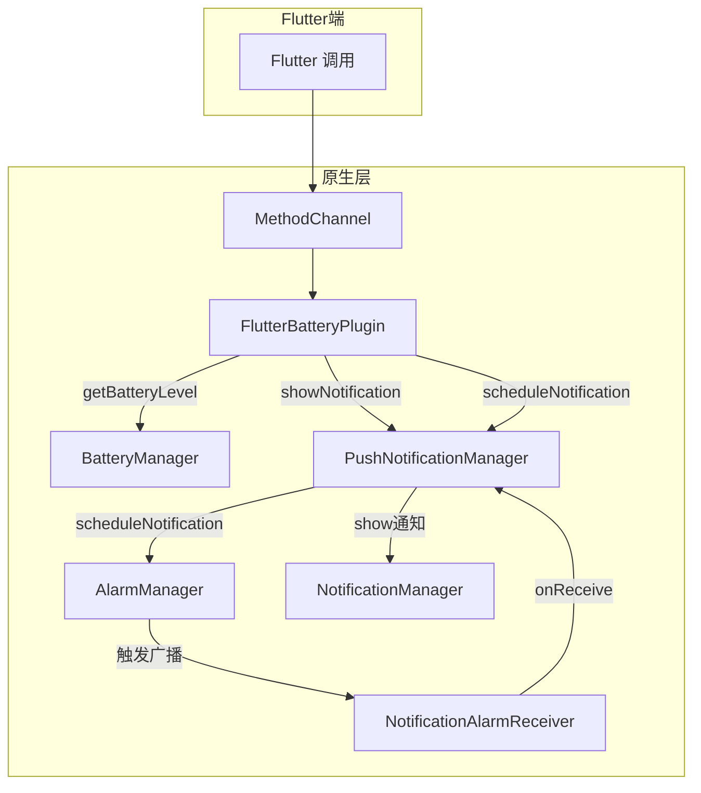

# flutter_battery

Flutter Android 推送通知插件，支持立即通知和延迟通知。

## 功能概述

- 获取平台版本信息
- 立即发送本地通知
- 调度延迟通知（通过 AlarmManager 和 BroadcastReceiver）

## 核心代码调用关系



## 使用方式

1. 在 `pubspec.yaml` 中添加本地依赖：
   ```yaml
   dependencies:
     flutter_battery:
       path: ../
   ```
2. 在 Dart 代码中导入并调用：
   ```dart
   import 'package:flutter_battery/flutter_battery.dart';

   final flutterBattery = FlutterBattery();

   // 获取平台版本
   String? version = await flutterBattery.getPlatformVersion();

   // 获取电池电量
   int? level = await flutterBattery.getBatteryLevel();

   // 立即发送通知
   await flutterBattery.showNotification(
     title: '示例标题',
     message: '示例内容',
   );

   // 调度延迟通知
   await flutterBattery.scheduleNotification(
     title: '延迟标题',
     message: '延迟内容',
     delayMinutes: 5,
   );
   ```

## 整体运行流程

1. **Flutter 层** 调用 `scheduleNotification` 或 `showNotification`
2. 通过 **MethodChannel** 将方法名和参数传递给原生层
3. **Android 原生层** 中的 `FlutterAssistantPlugin.onMethodCall` 接收调用
4. 根据方法类型调用 `PushNotificationManager`，执行通知逻辑
   - **立即通知**：通过 `NotificationManager` 直接显示
   - **延迟通知**：通过 `AlarmManager` 设置定时广播
5. **BroadcastReceiver** (`NotificationAlarmReceiver`) 在定时到达时触发，调用 `PushNotificationManager.showNotification`
6. **系统通知** 最终展示在通知栏

## 项目结构

```
flutter_battery/
├─ android/          # Android 原生插件实现
├─ lib/              # Dart 插件接口和方法通道实现
├─ example/          # 示例应用
└─ README.md         # 项目说明文档
```

---

izy | GitHub: https://github.com/lizy-coding

